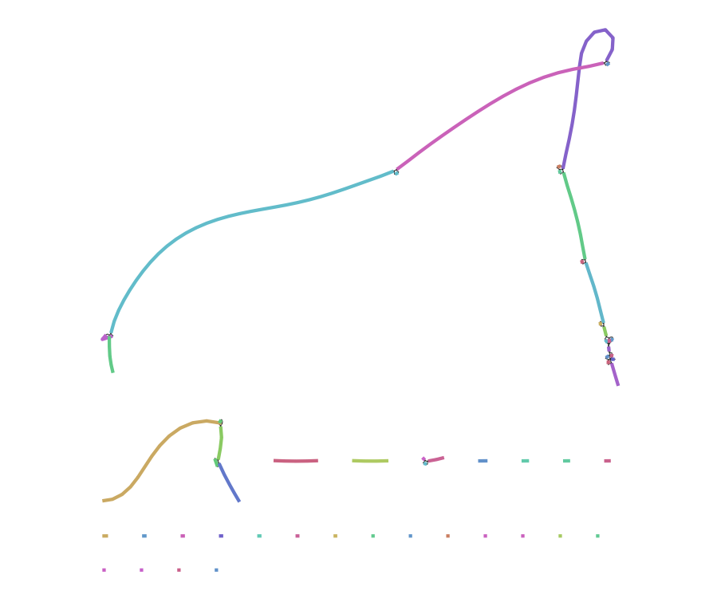
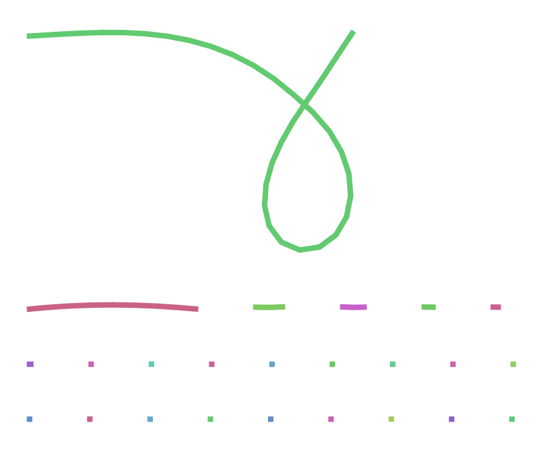

## DATOS

Vamos a usar lecturas HiFi generadas por [@Rabanal2022]. El primero paso es instalar hifiasm, no he podido hacerlo a través del código proporciondo usando git clone, poniendo el PATH bin, etc. Lo he instalado mediante conda, creando un entorno para poder trabajar con hifiasm.

Con este código comprobamos que el entorno de conda está activo y nuestro codigo de rstudio está bajo este entorno.

```{bash}
conda info --envs
```

Una vez descargados también el archivo `At4.10.fa.gz` podemos empezar la práctica.
```{bash}
if [ ! -e ../../data/At4.10.fa ]; then
  gunzip ../../data/At4.10.fa.gz
fi
```

## Revisión de los datos

::: {.callout-note icon="false"}
## Ejercicio 1

1. ¿Cuántas secuencias contiene el archivo? ¿Qué longitudes mínima, media y máxima tienen las secuencias? ¿Cuál es el número total de bases?

Se puede utilizar el comando grep para buscar "\>" que hay delante de cada secuencia, eso contará el numero de secuencias
```{bash}
grep -c ">" ../../data/At4.10.fa
```

Ignoramos las cabeceras "\>" y contamos las bases de cada secuencia, luego se usan para encontrar la secuencia minima, maxima y media
```{bash}
grep -v "^>" ../../data/At4.10.fa | awk '{len=length($0); sum+=len; if(min==""){min=max=len}; if(len<min){min=len}; if(len>max){max=len}; count++} END {print "Mínima:", min; print "Media:", sum/count; print "Máxima:", max}'
```

Eliminamos las cabeceras y los saltos de linea y contamos todos los caracteres
```{bash}
grep -v "^>" ../../data/At4.10.fa | tr -d '\n' | wc -c
```

2. Si se estimara que el genoma a ensamblar fuera de sólo 19 millones de bases, ¿cuál sería la cobertura esperada?

Cobertura = Total de bases/ Tamaño del genoma

```{r}
250599484/19000000
```
:::

## Ensamblaje

```{bash}
# Con la ejecución condicional nos ahorramos algún mensaje de error:
if [ ! -d asm1 ]; then mkdir asm1; fi
```

La siguiente condición la usamos para no tener que ejecutar la línea anterior cada vez que compilamos el documento de Quarto.

```{bash}
if [ ! -e asm1/At4.bp.p_ctg.gfa ]; then
   hifiasm -o asm1/At4 -t 2 -f 0 ../../data/At4.10.fa.gz 2> asm1/hifiasm.log
fi
```

::: {.callout-note icon="false"}
## Ejercicio 2

Consulta la ayuda de `hifiasm` (`hifiasm -h`) y contesta las preguntas siguientes:

1. ¿Los parámetros corresponden al ensamblaje de un genoma haploide o diploide?

Los parámetros corresponden a un ensamblaje diploide, ya que hifiasm está diseñado para separar haplotipos materno y paterno.

2. ¿Qué nivel de eliminación de duplicaciones hemos aplicado? (El paso de eliminar duplicaciones sirve para que las zonas de alta heterocigosidad no sean ensambladas como contigs diferentes).

En el comando del ensamblaje aparece -f 0, eso significa que no hay eliminación de duplicaciones.

3. Si tuvieramos lecturas ultra-largas, ¿con qué opción o argumento añadiríamos esa información?

Se añadirían mediante la opción --ul, que permite incorporar lecturas ultra-largas al ensamblaje.
:::

## Evaluación del resultado

::: {.callout-note icon="false"}
## Ejercicio 3

Consulta la descripción de los archivos de salida que encontrarás en este enlace y contesta las preguntas siguientes:

1. ¿Dónde están las secuencias que componen el ensamblaje?

Las secuencias que componen el ensamblaje están en los archivos `.gfa`, concretamente en las líneas `S` de esos ficheros, que contienen la secuencia de cada segmento del ensamblaje

2. En los archivos .gfa, ¿qué son las líneas que empiezan por ‘A’?

En los archivos `.gfa`, las líneas que empiezan por `A` contienen la información de las lecturas usadas para construir cada contig o unitig, incluyendo nombre del contig/unitig, posición, hebra, nombre de la lectura, coordenadas de la parte usada, identificador de la read y estado haplotípico.

3. ¿Qué información tiene los archivos .bed?

Los archivos `.bed` contienen las coordenadas de las regiones de baja calidad (low quality regions) en formato BED.

4. ¿Cuál es la cobertura media estimada de las secuencias homocigotas?

La cobertura media estimada de las secuencias homocigotas es 57X

5. ¿Y la de las heterocigotas?

La cobertura media estimada de las secuencias heterocigotas es 28X 

:::

```{bash}
awk '(/^S/){print ">" $2 "\n" $3}' asm1/At4.bp.p_ctg.gfa > asm1/At4.fa
```

## Calidad del ensamblaje
Voy a descargar `compleasm` [@Huang2023] usando `conda`. He tenido que instalar `mamba` porque desde
`conda`no me dejaba descargarlo. Con esto no he podido por problemas de dependecias
entre `conda`y `compleasm`, he creado un entorno a través de un comando que me ha dado la IA.
No sé si funcionará. 
He intentado todas las opciones que me da la IA, pero ninguna funciona, el problema 
es que al instalar `compleasm` desde `conda`se generan un problema de depencias en `sepp`
y `dendropy`que sinceramente no sé que son, pero es lo que me pone la IA. 

También lo he intentado por una herramienta llamada `Docker`, pero entre que no sé como funciona
y que la IA en este caso no me ayudó mucho pues no llegué muy lejos. 

Después de un par de horas intentadolo no soy capaz.
Sólo me queda intentarlo por la máquina virtual, pero hoy 9/05/2026 no lo voy a intentar.
Si lees estos mensajes es que no he podido intentarlo por la máquina virtual, lo siento. 

**Aqui Yago al rescate con un fork y un Pull Request**

Primero descargamos compleasm y lo descomprimimos en la carpeta de bin, todo con condicionales para eviar errores:
```{bash}
#| eval: false

if [[ ! -d ~/bin ]]; then
  mkdir -p ~/bin
fi

cd ~/bin

if [ ! -d ~/bin/compleasm_kit ]; then
  wget https://github.com/huangnengCSU/compleasm/releases/download/v0.2.7/compleasm-0.2.7_x64-linux.tar.bz2
  tar -jxvf compleasm-0.2.7_x64-linux.tar.bz2
  rm compleasm-0.2.7_x64-linux.tar.bz2
fi
```
Instalar pandas de pyhton en WSL es tan fácil como tirar por la terminal de bash:
```
sudo apt update
sudo apt install python3-pandas
```

Ahora corremos la evaluacion (puede tardar mas de 10 min):
```{bash}
#| message: false

if [ ! -e asm1_eval/summary.txt ]; then
   python3 ~/bin/compleasm_kit/compleasm.py run \
      -t 6 -l brassicales -a asm1/At4.fa -o asm1_eval
fi
```
Los archivos que crea la evaluación serán muy pesados, como lo único que importa para el repo es el log he añadido esto a un .gitignore:
```
asm1_eval/
!asm1_eval/summary.txt
```
Podemos leer por pantalla el summary:
```{bash}
cat asm1_eval/summary.txt
```

::: {.callout-note icon="false" title="Ejercicio 4"}
Consulta la ayuda de `compleasm.py` y averigua qué significan los argumentos utilizados.

::: {.callout-important icon="false" title="Respuesta"}
```{bash}
python3 ~/bin/compleasm_kit/compleasm.py run -h
```
- t Permite dar un número de hilos de procesamiento, lo he subido a 6 porque mi ordenador personal me lo permite, un valor seguro es utilizar 2, pero depende de cada ordenador, cuantos mas hilos, más rápido correrá el proceso

- l hace referencia al linaje del organismo que vamos a evaluar, en este caso *brassicales* y busca el conjunto de genes ortólogos que busca el programa

- a da el archivo de entrada que se quiere evaluar, el genoma

- o es la ruta de salida donde se guardarán los resultados
:::
:::

## Visualización del grafo

He instalado `bdandage`y he realiza dos grafos:
El primero es del archivo `At4.bp.p_utg.gfa` de los unitigs procesados y el segundo es del
archivo `At4.bp.p_ctg.gfa`de los primary contigs. 

{#fig-unitigs fig-align="center"}

{#fig-primary fig-align="center"}

No he puesto los nombre de cada fragmento porque me parecía muy saturado. Tampoco sé muy bien como
interpretar estos grafos. Entiendo que en el primero los puntos más pequeños son estrcuturas repetitivas, no lo sé con claridad. 

## Bibliografía


